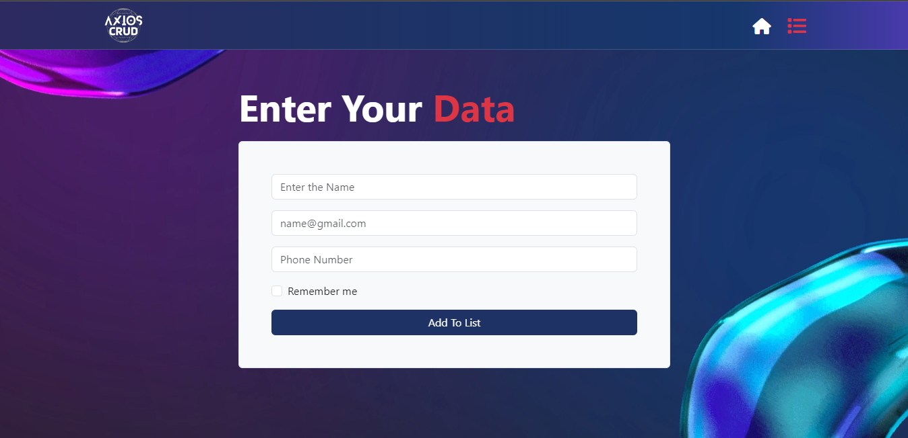

# CRUD Using Axios

A simple CRUD (Create, Read, Update, Delete) application built using React and Axios. This project demonstrates how to perform basic CRUD operations on user data.

## Features

- Add new user data to the list
- View a list of users with their details
- Update user data
- Delete user data from the list

## Live Demo

Check out the live demo of the project: [Axios using CRUD demo](https://react-axios-task-using-crud.netlify.app/)

## Screenshots




## Install dependencies:

```bash
npm install
```

Start the development server:

```bash
npm start
```

Open your browser and navigate to http://localhost:3000 to view the application.

## Technologies Used

- React
- Axios
- React Router
- Bootstrap
